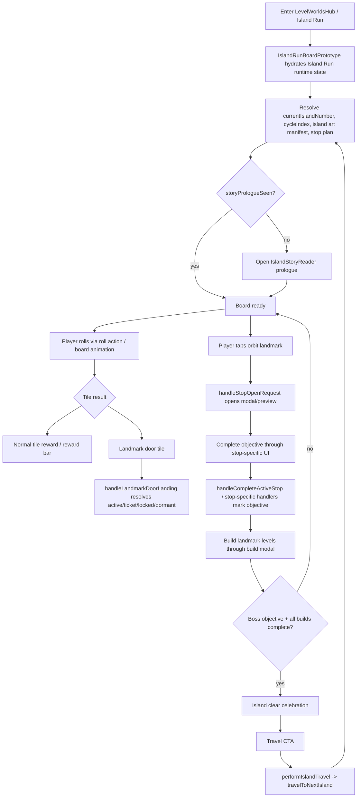
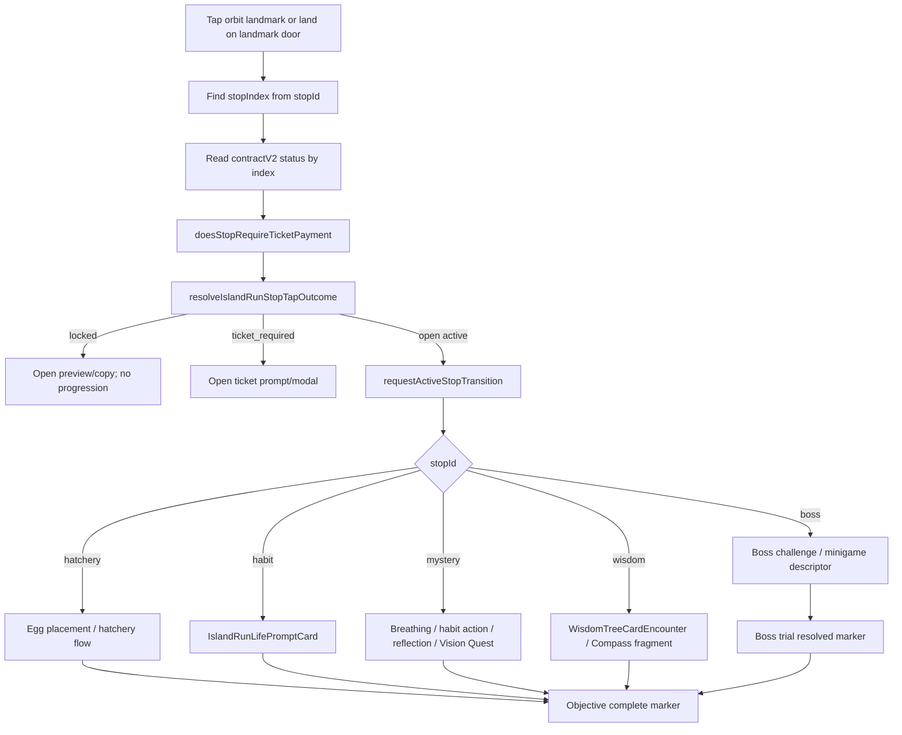
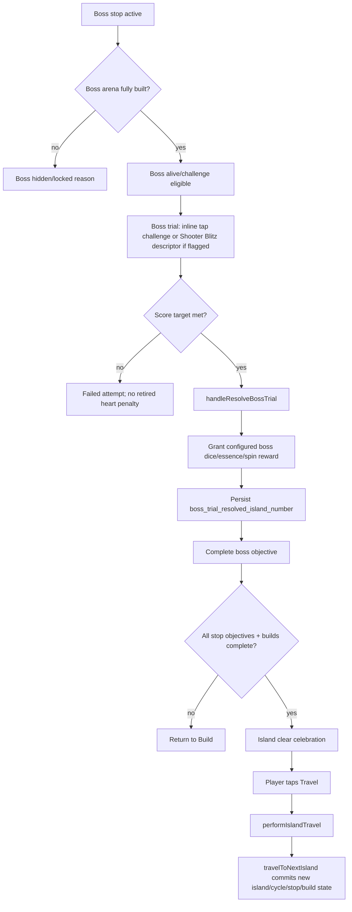
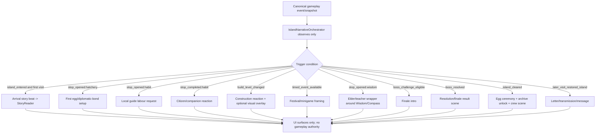

# Holistic Island Storytelling System Audit

Status: investigation only  
Date: 2026-06-25  
Report path: `docs/investigations/holistic-island-storytelling-system-audit.md`

## A. Executive summary

HabitGame already contains several reusable foundations for a holistic island-story system, but they are not one cohesive narrative engine today.

**What exists and is live**

- The production Island Run entry still runs through `IslandRunBoardPrototype`, which owns most modal, roll, stop, build, boss, travel, story-reader, creature, and minigame presentation wiring.
- The canonical gameplay contract is a five-stop sequence: `hatchery -> habit -> mystery -> wisdom -> boss`, with stops/landmarks decoupled from board tile indices.
- A manifest-driven `IslandStoryReader` exists and is mounted in the board with `public/storyline/episode-001/manifest.json`.
- The board auto-opens the prologue story when `storyPrologueSeen` is false and records closure through `applyStoryPrologueSeenMarker` plus a localStorage fallback.
- Island art manifests already support island-specific backgrounds, board plates, scenery, landmark build-level images, and boss idle/defeated images.
- Audio/SFX/music services exist, including board playlists, celebration music, event/boss/shop tracks, SFX, haptics, reduced-motion-aware haptics, and user-enabled music/SFX preferences.
- Compass Book has a 120-island curriculum mapping, six chapters, local/Supabase persistence, in-game island fragment splitting, and dedicated UI components.
- Creature state, active companion state, egg slots, egg reward inventory, creature manifests, sanctuary cards, hatch reveal, and companion bonuses exist and persist through Island Run runtime state.
- The minigame/event foundation includes a registry, lazy launcher, four event IDs, timed-event state, ticket ledgers, and launch descriptors for boss, mystery, and timed-event contexts.

**What is disconnected, demo-only, or incomplete**

- `IslandStoryReader` is real UI, but the only public story episode is a placeholder prologue. Its manifest reward is labeled `coins`, but it is wired to `sanctuaryHandlers.storyRewardClaim`, whose parameter is treated as an Essence-style local board reward; it is not a canonical story reward economy.
- There is no generalized story-beat persistence beyond `storyPrologueSeen`; no per-island story stage, optional dialogue seen, artefact ledger, finale result, archive unlock, or post-island messages exist.
- The minigame registry comments say registration is intentionally not imported by the main bundle until later wiring, while current board code has bespoke launch paths and feature-flagged descriptors. Treat the registry as a foundation, not a proven universal runtime router.
- Wisdom content exists as a small Wisdom Tree card set and as Compass fragments, but there is no NPC elder/teacher definition layer.
- Speech/dialogue primitives exist as modal cards, Wisdom choices, coach/helper layouts, creature cards, and general UI copy, but there is no reusable world-character conversation component.
- Island visual progression can swap landmark levels and boss defeated state, but returning citizens, repaired bridges, faction flags, NPC activity, clue overlays, and final restored-island environmental states would require an additive visual-state layer.

**Most important architectural constraint**

A future story system must not become a second Island Run engine. It should observe or respond to canonical gameplay events and use canonical action services for any gameplay mutation. It must not add gameplay writes inside React UI components, new runtime-state mirrors, duplicate stop/dice/reward logic, or couple story progression to board tile indices. Existing runtime code is still partially migrated, so new narrative orchestration should be a thin layer above existing canonical events and manifests, not inside the board loop.

## B. Existing-system inventory

| System | Purpose | Key files / symbols inspected | Runtime status | Persistence | Reusability | Risks | Recommended story role |
|---|---|---|---|---|---|---|---|
| Island Run board shell | Main Island Run UI/controller | `IslandRunBoardPrototype`, `handleStopOpenRequest`, `handleLandmarkDoorLanding`, `handleCompleteActiveStop`, `performIslandTravel` | Production entry and highest-risk mixed-authority surface | Runtime state table + local mirrors | Extend only through narrow seams | Very large component, legacy direct state mirrors, modal coupling | Observe lifecycle; avoid embedding story engine directly |
| Canonical state/actions | Canonical gameplay read/write target | `useIslandRunState`, `islandRunStateStore`, `islandRunStateActions`, roll/tile actions | Active migration target | `island_run_runtime_state` + local fallback | Reuse for gameplay-safe mutations | Some UI still uses bridge/mirror paths | Story layer should read snapshots and request canonical actions only when needed |
| Five-stop plan | Fixed stop contract | `generateIslandStopPlan`, `IslandStopPlanEntry`, `MysteryStopContentKind` | Live | Stop states/build states by index; completed stops by island | Reuse as event triggers | Do not rename IDs without dependency audit | Story beats attach to stop IDs, not tile indices |
| Stop tap/door routing | Opens active/locked/ticket/dormant stop flows | `resolveIslandRunStopTapOutcome`, `handleStopOpenRequest`, `handleLandmarkDoorLanding` | Live | Ticket payments and completed states persist | Reuse as trigger source | Door minigames are not stop authority | Story can wrap modal openings and door arrivals |
| Hatchery | Egg placement/incubation/resolve | `handleSetEgg`, hatchery carousel, `perIslandEggs`, egg migrations | Live | active egg columns, per-island eggs, egg reward inventory | Wrap ceremony around existing egg lifecycle | Do not alter probabilities/economy | Egg/diplomatic-bond ceremony after existing reward resolution |
| Habit Landmark | Habit creation/life intake | `IslandRunLifePromptCard`, `createIslandRunHabitFromLifePrompt`, `recordGameLifeIntake`, `recordCompassContribution` | Live | Habits, game life intake, Compass contribution | Wrap as local labour/citizen aid | External habit persistence errors tolerated | Local guide requests player help via existing habit flow |
| Mystery Landmark | Rotating breathing/habit/check-in/Vision Quest | `MysteryStopContentKind`, `resolveMysteryStopMinigame`, `IslandRunReflectionComposer` | Live/feature-flagged variants | Journal/check-in/habit data; stop completion | Extend carefully as cultural/event landmark wrapper | Stop ID must remain `mystery`; content kinds have dependencies | Present as festival/cultural landmark while retaining current content kinds |
| Wisdom Landmark | Wisdom choices + Compass fragments | `WisdomTreeCardEncounter`, `wisdomTreeCards`, `CompassStopFragment*`, `islandFragment` | Live/partial | Wisdom choices mostly local to stop completion; Compass answers persist | Wrap with elder/teacher NPC | Need clear distinction between Wisdom Tree demo vs Compass data | Elder/historian surface for structured reflection |
| Boss/finale | Boss arena build, trial, rewards, island clear | `islandRunBossEncounter`, `bossService`, `handleResolveBossTrial`, `handleCompleteActiveStop` | Live | `boss_trial_resolved_island_number`, stop states, boss state | Extend carefully | Strong labels: boss, fight, defeat, arena; rewards coupled to boss completion | Add compatibility `IslandFinaleDefinition` over existing boss completion semantics |
| Story reader | Webtoon/episode modal | `IslandStoryReader`, `/public/storyline`, manifest schema | Wired and auto-launched for prologue | `storyPrologueSeen` only | Reuse as episode renderer | Placeholder content; reward mismatch; no episode ledger | Arrival/prologue/resolution illustrated sequences |
| Story persistence | Prologue seen flag | migration `0190_island_run_onboarding_and_story_sync`, `applyStoryPrologueSeenMarker` | Live | DB boolean + localStorage fallback | Reuse pattern only | Insufficient for 120-island story | Phase 1 can use localStorage/manifest read-only; later needs story ledger |
| Island art manifests | Board/landmark/boss/scenery art | `islandArtManifest`, `IslandArtLayers`, `public/assets/islands/island-*/island-art.json` | Live for islands 1-12 manifests; many placeholders | Build level drives landmark images; boss defeated drives boss image | Reuse heavily | No NPC/overlay state layer; placeholders | Environmental transformation foundation |
| Audio/music/SFX | Board, celebration, modal, minigame audio | `islandRunAudio`, `islandRunMusic`, public audio assets | Live, user-enabled | Runtime audio prefs | Reuse | Mobile autoplay/user consent; limited per-island themes | Layered/progression music later; use existing tracks for pilot |
| Minigame registry/launcher | Lazy minigame shell and descriptors | `IslandRunMinigameLauncher`, registry, manifests, launcher service | Partly wired; registry not universal | Timed-event tickets/progress | Wrap with narrative | Some games not registered/live via unified path; flags vary | Narrative framing separate from minigame logic |
| Event engine | Timed-event rotation/progress | `islandRunEventEngine`, reward-bar event functions | Live foundation; flag only gates telemetry per comments | active timed event/progress, tickets, sticker state | Reuse as event trigger source | Feeding Frenzy lacks dedicated surface | Festival/cultural wrappers around active event/minigame |
| Compass Book | 120-island personal curriculum | `compassBookCurriculum`, `useCompassBook`, `compassBookLocalStore`, services | Live feature | LocalStorage + Supabase tables via service | Extend additively | Must not merge world archive into current answer model | Add separate expedition archive layer, linked by island |
| Creatures/companion | Collection, active companion, eggs, cards | `creatureCatalog`, `creatureCollectionService`, `islandRunCreatureCollectionLedger`, `Creature*` components | Live | runtime JSON columns + local fallback | Wrap with commentary | No canonical dialogue memory | Companion reaction layer reads active companion |
| Documentation/guardrails | Contracts and migration policy | gameplay contracts, open issues, plans/investigations | Active policy | Docs | Must follow | Some docs are older than runtime | Use runtime code as source of truth |

## C. Storytelling-channel matrix

| Channel | Exists | Partial | Missing | Reusable foundation | Recommended priority |
|---|---:|---:|---:|---|---|
| Story reader/webtoon | Yes | Yes | Episode ledger | `IslandStoryReader`, manifest folder, audio/video/image/text support | High |
| Speech bubbles | No dedicated reusable world component | Yes | Conversation schema | Wisdom cards, modal copy, Compass helper/chat-like primitives | High for pilot |
| Creature commentary | Creature state exists | Yes | Dialogue memory/beat system | active companion, creature catalog/cards | Medium |
| Arrival scenes | Prologue only | Yes | Per-island arrival trigger | auto-launch story reader pattern | High |
| Environmental changes | Landmark/boss art | Yes | NPC/overlay/restored state | island art manifests and build-level images | Medium |
| Animated stills | CSS/video support | Yes | Story panel animation schema | story reader image/video + CSS animations | Medium |
| Letters/messages | Generic notifications/offers exist | Yes | Island message inbox | localStorage patterns and modal primitives | Low/medium |
| Compass archive | Personal curriculum exists | Yes | World-story records | Compass Book screens, island mapping | Medium |
| Artefacts/clues | No durable island clue ledger | Partial via puzzle/tech collection assets | Yes | tech collection/grid and reward inventories as conceptual pattern | Medium |
| Crew scenes | No crew model | Partial via onboarding/companion UI | Yes | story reader, modal cards | Low until characters defined |
| Event framing | Event/minigame engine exists | Yes | Narrative wrapper schema | event IDs/descriptors, launcher shell | High |
| Finale scenes | Boss completion celebration | Yes | Non-combat finale abstraction | boss trial service + island clear modal | High after pilot |
| Music | Yes | Yes | Layered per-island restoration | `islandRunMusic`, audio assets, prefs | Medium |
| NPC activity | No | Partial via art manifests/scenery | Yes | scenery overlays | Low/medium |

## D. Runtime flow diagrams

### 1. Current island lifecycle



### 2. Current stop-routing lifecycle



### 3. Current boss-to-next-island lifecycle



### 4. Proposed story-orchestration insertion points



## E. Reuse / extend / build-new map

| Area | Classification | Notes |
|---|---|---|
| Story reader renderer | Reuse as-is for pilot; extend carefully later | Already supports text/image/video/caption/soundtrack and viewport modal behavior; add episode ledger later. |
| Prologue seen marker | Reuse pattern, not schema | Boolean is insufficient beyond one prologue. |
| Island stop IDs | Reuse as-is | Do not rename/remove canonical IDs. |
| Mystery landmark | Wrap with narrative | Keep `mystery` ID and current content kinds; cultural/event framing can be external copy and arrival/beat wrapper. |
| Wisdom Tree cards | Wrap with narrative | Elder/teacher can introduce existing choices; persistence is mostly stop completion unless Compass fragment is used. |
| Compass Book curriculum | Extend carefully | Add world archive as adjacent data/model, not inside personal answer progress. |
| Boss finale | Extend carefully | Add `IslandFinaleDefinition` facade while still completing current `boss` stop and reward semantics. |
| Minigame logic | Wrap with narrative | Keep underlying launch/completion/reward callback unchanged. |
| Timed event engine | Reuse as event source | It already defines event IDs/tickets/progress. |
| Creature collection/companion | Wrap with narrative | Read active companion and catalog; do not alter acquisition/probabilities. |
| Island art build-level swaps | Reuse | Good for repaired landmarks. |
| NPC/environment overlays | Build new | Add additive visual-state layer keyed by story/build/completion without gameplay authority. |
| Dialogue/conversation component | Build new | No reusable world-character conversation primitive found. |
| Letters/messages | Build new or reuse notification primitives | Need product decision on inbox vs modal-only. |
| Artefact/clue ledger | Build new later | Could start visual-only/local for pilot; durable mystery needs persistence. |
| Layered restorative music | Extend carefully | Existing music service supports playlists/tracks, not stems/layers. |
| Content tooling for 120 islands | Build new | Existing `public/storyline` is too flat for 120-island production. |

## F. Proposed compatibility-preserving architecture

Conceptual only; no implementation in this investigation.

```ts
type IslandNarrativeDefinition = {
  islandNumber: number;
  civilization: string;
  theme: string;
  arrivalEpisode?: string;
  characters: IslandCharacterDefinition[];
  beats: IslandStoryBeat[];
  finale: IslandFinaleDefinition;
  archiveEntries: IslandArchiveEntry[];
};

type IslandStoryBeat = {
  id: string;
  trigger:
    | { kind: 'island_entered'; firstVisitOnly?: boolean }
    | { kind: 'stop_opened'; stopId: 'hatchery' | 'habit' | 'mystery' | 'wisdom' | 'boss' }
    | { kind: 'stop_completed'; stopId: string }
    | { kind: 'build_level_reached'; stopId: string; level: 1 | 2 | 3 }
    | { kind: 'timed_event_available'; eventId: string }
    | { kind: 'boss_resolved' }
    | { kind: 'island_cleared' };
  surface: 'story_reader' | 'dialogue' | 'companion_reaction' | 'modal_scene' | 'archive_unlock' | 'audio_cue' | 'visual_overlay';
  contentRef: string;
  repeatPolicy: 'once_per_user' | 'once_per_island_cycle' | 'repeatable';
};

type IslandFinaleDefinition = {
  finaleType:
    | 'guardian_battle'
    | 'guardian_rescue'
    | 'diplomatic_summit'
    | 'festival'
    | 'sports_competition'
    | 'dance_music_ritual'
    | 'great_construction'
    | 'excavation'
    | 'collaborative_challenge'
    | 'puzzle'
    | 'symbolic_inner_trial';
  usesCanonicalBossStop: true;
  bossRewardCompatibility: 'unchanged';
  completionEvent: 'boss_objective_complete';
};
```

Compatibility rules:

1. Narrative definitions are content/config, not gameplay state machines.
2. Story triggers are derived from canonical stop/build/boss/island-clear events and current runtime snapshots.
3. All gameplay mutation remains in existing actions/services.
4. Phase 1 may avoid schema changes by using existing `storyPrologueSeen` only for the current prologue and localStorage for non-critical pilot beat suppression, but durable multi-island story requires a later story ledger.
5. `boss` remains the canonical fifth stop even when the player-facing finale is diplomatic, festival, rescue, or construction.
6. `mystery` remains the canonical third stop even when framed as a broader cultural/event landmark.

## G. Recommended phased plan

### Phase 0 — Content and architecture contract

- Author a story architecture contract that explicitly forbids duplicate Island Run engines, UI gameplay writes, stop-ID renames, tile-index coupling, economy/reward changes, and creature probability changes.
- Define content schemas for `IslandNarrativeDefinition`, `IslandStoryBeat`, `IslandCharacterDefinition`, `IslandFinaleDefinition`, and `IslandArchiveEntry`.
- Decide emotional-safety tone and coaching boundaries for elder/teacher/companion dialogue.
- Dependency: product approval of narrative tone and pilot island scope.
- Risk: content model too large for the first pilot.

### Phase 1 — One pilot island using existing systems

- Use `IslandStoryReader` for arrival/resolution panels.
- Use existing stop modals with narrative wrapper copy only.
- Use current build-level art and boss defeated state.
- Use localStorage-only beat suppression for non-critical pilot scenes if schema changes are deferred.
- Do not alter rewards, stop progression, boss completion, egg probabilities, or save format.
- Dependency: pilot content package and asset availability.
- Risk: board component is large; prefer thin wrapper surfaces and feature flag.

### Phase 2 — Reusable dialogue and story-beat layer

- Build a viewport-safe dialogue/conversation component using existing modal guardrails.
- Add a story orchestrator that reads gameplay snapshots and emits UI-only story surfaces.
- Add durable beat ledger only after product approves fields.
- Dependency: persistence decision.
- Risk: accidentally creating a second gameplay progression authority.

### Phase 3 — Non-combat finale abstraction

- Add `IslandFinaleDefinition` facade while preserving canonical `boss` stop completion and current reward semantics.
- Rename only player-facing copy when appropriate; do not rename persisted stop IDs.
- Dependency: finale taxonomy and compatibility tests.
- Risk: hidden assumptions in boss UI labels/rewards/telemetry.

### Phase 4 — Board/environment transformations

- Extend island art manifest with optional visual overlays/NPC states keyed by build/story/completion.
- Use CSS transforms, opacity, parallax, pans/zooms, particles, and existing image layers.
- Dependency: asset-production workflow.
- Risk: mobile performance and placeholder-asset sprawl.

### Phase 5 — Compass archive and world mystery

- Add an expedition/world archive adjacent to the personal Compass Book.
- Link archive unlocks to island completion and discovered artefacts without mutating personal curriculum answers.
- Dependency: data model and product archive taxonomy.
- Risk: conflating self-reflection answers with fictional lore records.

### Phase 6 — Scalable content tooling

- Move from flat `public/storyline/episode-*` to island content packages.
- Add manifest validation, asset-dimension checks, missing-file checks, and preview tooling.
- Dependency: stable package schema.
- Risk: 120 islands require production discipline, naming conventions, and validation CI.

Recommended package shape for future content only:

```text
public/islands/001/
  island.json
  story/
  characters/
  landmarks/
  finale/
  audio/
  archive/
```

Do not move current files until tooling and references are ready.

## H. Pilot-island recommendation

**Recommended pilot: Island 1.**

Reasons:

- Island 1 has the richest non-placeholder art among inspected islands: ambient background, board circle, a battle-center scenery asset, black crystal dragon idle/defeated boss images, and level-3 hatchery art references.
- It is the first player experience, already paired with the prologue story auto-launch path.
- It uses the fixed early Habit curriculum (`Health`) and has low boss difficulty.
- It can validate the full story loop without requiring new economy, schema, creature probability, or progression changes.

Vertical slice using existing systems:

1. **Arrival** — `IslandStoryReader` loads a real Island 1 arrival manifest instead of placeholder prologue content.
2. **Local guide dialogue** — a new lightweight dialogue wrapper introduces the Hatchery/Habit landmarks, but gameplay still opens the existing stop modals.
3. **Wisdom encounter** — an island elder wraps `WisdomTreeCardEncounter` or the Compass fragment for Island 1.
4. **Building milestone** — when a landmark reaches Level 1/2/3, show a UI-only construction reaction and rely on current build-state persistence.
5. **Minigame framing** — if the timed event/minigame surface is available, frame it as a local festival without changing tickets or completion callback.
6. **Companion reaction** — if `activeCompanionId` exists, show optional commentary using creature catalog name/art; if not, omit without blocking.
7. **Central finale** — keep current Boss stop and boss reward path; frame black-crystal dragon as a guardian imbalance/restoration encounter.
8. **Resolution** — after boss resolved/island clear, show a short story-reader resolution scene.
9. **Egg ceremony** — wrap the existing hatch/egg reward or Hatchery flow as a diplomatic-bond ceremony; do not change tier odds or acquisition.
10. **Compass/archive entry** — add a pilot read-only archive card outside current Compass answer progress or defer to Phase 5 if persistence is not approved.
11. **Next-island transition** — keep current island-clear celebration and `performIslandTravel` CTA semantics.

## I. Questions requiring product decisions

### Product decisions

1. Is the player a diplomat/restorer from the start, or should Island 1 reveal that identity gradually?
2. Should every island have a named local guide/elder, or only key islands?
3. What is the tone boundary for Wisdom figures: mystical, coaching, therapeutic-adjacent, or purely reflective?
4. Which finale types are allowed in the first 20 islands, and should combat be rare or common?
5. Should creature eggs represent rescued creatures, diplomatic bonds, sanctuary adoption, or a separate reward fiction?
6. Should the world mystery be discoverable linearly, optional, or gated by archive completion?
7. Should restored islands send later letters/messages, and where should those live in navigation?
8. How much player choice should be remembered narratively versus kept cosmetic/non-persistent in Phase 1?

### Technical questions still requiring validation before implementation

1. Which production entry path(s) besides `IslandRunBoardPrototype` can open Island Run on all supported devices?
2. Which minigame manifests are actually registered in the current production bundle under deployed flags?
3. Which Supabase Compass tables and RLS policies are deployed in the target environment?
4. How much modal stacking can mobile tolerate when story, stop, minigame, and celebration modals compete?
5. Which island art assets are final versus placeholders for islands 2-12?

## J. Final verdict

**PASS WITH CONDITIONS**

Safe to proceed to pilot design if the following conditions are enforced:

1. Pilot work remains additive and feature-flagged.
2. Story layer observes canonical gameplay state/events and never becomes a second gameplay engine.
3. No schema migration is introduced until product approves durable story fields.
4. No economy, creature probability, boss reward, stop ID, or Island Run save-format changes are made in the pilot.
5. `mystery` and `boss` remain canonical stop IDs; player-facing labels can be narratively wrapped later.
6. Story rewards are disabled or explicitly mapped to existing canonical reward actions before production use; the current `coins` manifest reward must not be treated as canonical.
7. Mobile modal guardrails, user-consented audio, and reduced-motion constraints remain mandatory.

## Appendix — required investigation areas coverage

- Story infrastructure: `IslandStoryReader`, `public/storyline`, manifest schema, prologue marker, migration `0190`.
- Island lifecycle: board hydration, rolling, tile/door routing, stop modal opening, stop completion, building, boss, island clear, travel.
- Stop system: five canonical stop IDs, Mystery content kinds, tap outcomes, tickets, completion blockers.
- Wisdom/coaching: Wisdom Tree cards, Compass Book fragments, life-prompt card, reflection composer, journal persistence, game life intake.
- Character/dialogue: no dedicated world-dialogue component found; closest primitives are Wisdom card, Compass helper/guided flow, modal cards, creature cards.
- Creatures: creature assets, collection, active companion, egg runtime columns, egg reward inventory, hatch flows.
- Boss/finale: boss arena build requirement, visible states, challenge eligibility, trial config, rewards, boss resolved marker, island clear.
- Events/minigames: event IDs, minigame manifests, registry, lazy launcher, launcher descriptors, timed-event tickets/progress.
- Building/environment: build-state by stop index, island art manifest levels, scenery, boss images, ambient backgrounds.
- Audio/media: SFX/haptics, board music playlists, story-reader soundtrack/video handling, mobile autoplay-safe toggles.
- Compass/archive: 120-island curriculum and additive archive recommendation.
- Persistence/data: runtime table columns, localStorage mirrors, Compass local store, journal/habit/check-in persistence.
- Assets/workflow: public assets inventory and recommended future package structure.
- Existing plans/conflicts: active contracts, guardrails, minigame plan comments, and runtime-vs-doc conflict policy.
