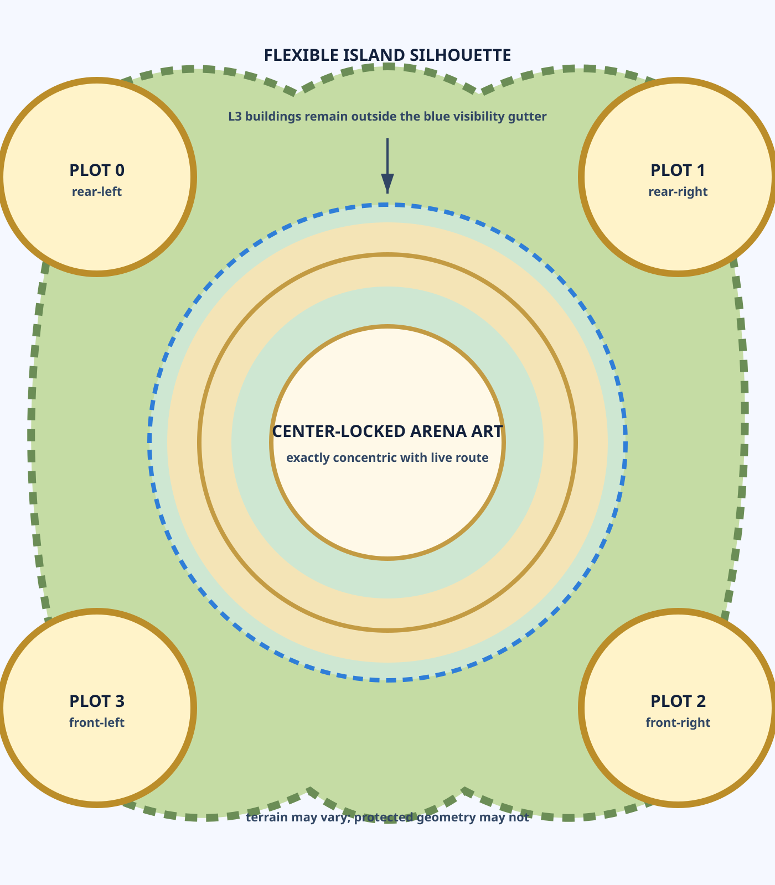

# Island Run — 120-Island Production System

Status: **canonical production reference**

This is the starting point whenever an agent is asked to create, regenerate,
place, or review an Island Run island. Island 001 is the pilot, but the system
must remain reliable for all 120 islands.

## The invariant and the freedom

The island silhouette may be circular, square, asymmetric, split, crescent,
rocky, mechanical, or otherwise story-specific. The art does **not** need to
look like Island 001.

The following geometry does not change:

- one exact 36-tile route generated from the live tile anchors;
- one central arena whose visual center is locked to the live route center;
- four fixed landmark plot centers outside the protected route gutter;
- one entrance direction and bottom anchor for each landmark;
- one camera focus target per landmark;
- enough clearance for all four largest L3 silhouettes at the same time.

The route foundation is code-owned. The separate arena asset is optically
centered on that same live anchor and validated in the phone composite. Never
paint a second approximate route, tile circle, or arena ring into the terrain
plate. Terrain supplies materials and visual integration; gameplay code
supplies the playable circle.



## Runtime layer stack

Back to front:

1. ambient background;
2. organic central terrain/cliff plate;
3. four persistent landmark terrain plots (`levelZero`);
4. code-owned route foundation plus the center-locked arena asset;
5. 36 live tiles, token, fragments, and traffic light;
6. landmark L1–L3 cutouts, each bottom-anchored to its plot;
7. boss, labels, fog, camera effects, and HUD.

The central terrain and four satellite plots must be separate assets. This lets
future islands vary their outer silhouette without distorting fixed gameplay
anchors, and lets a plot remain visible before its building exists.

## Canonical geometry envelope

Island art uses a 1400 × 1600 scene with a 1000 × 1000 playable board rectangle
at `(200, 300)`. The route is derived from the live anchors, not manually copied
from these notes. Island 001's production manifest demonstrates the contract:

| Element | Manifest source | Island 001 pilot |
| --- | --- | --- |
| central terrain | `scene.boardCircle` | 1400 × 1400 transparent plate |
| route material | `boardFoundation` | ivory/gold material tokens |
| rear-left plot | `levelZeroPlacement` | center `(175, 320)`, 350 × 350 |
| rear-right plot | `levelZeroPlacement` | center `(1225, 320)`, 350 × 350 |
| front-right plot | `levelZeroPlacement` | center `(1225, 1280)`, 350 × 350 |
| front-left plot | `levelZeroPlacement` | center `(175, 1280)`, 350 × 350 |
| protected route radius | validator contract | 43% of playable-board width |

These are pilot measurements, not hand-placement suggestions. Copy the
template manifest or use its generator; do not retype approximate positions.
The validator checks both each plot rectangle and the largest scaled L3
building rectangle against the protected route radius.

## Landmark fit rule

Every landmark family has one persistent plot and three additive build states.

- The plot is large enough to read as a real island site at 390 × 844.
- L1, L2, and L3 share the same optical center, entrance, camera, and bottom
  anchor.
- The building naturally fills its plot; unused space must read as an authored
  courtyard, garden, work area, or habitat.
- The front entrance points toward the central island/path.
- The largest L3 silhouette is the validation case. If L3 is safe, earlier
  levels must remain safe without drifting upward or sideways.
- Tall buildings may not cross the protected visibility gutter even when their
  transparent canvas technically does not touch a tile.

The renderer sizes each level within the manifest placement and preserves the
bottom anchor. Do not solve level growth by changing `x` or `y` per level.

## Camera behavior

Each orbit landmark control derives its camera target from the manifest plot
center, then constrains that target to a phone-relative safe inset. This keeps
the building in a rule-of-thirds close-up without exposing empty canvas beyond
an edge plot. Front/lower plots receive an additional viewport-relative lift so
their tallest buildings remain above the controller. A tap starts `stop_focus`,
then opens the appropriate modal.
Closing the modal leaves the camera focused on the landmark so the player can
inspect it. The next roll returns the camera to board-follow mode automatically.

This behavior is required for every landmark on every island. Labels may keep
separate screen-safe positions; label placement is not a camera target.

## Production packet per island

Create this structure before approval:

```text
work/island-visual-library/island-NNN-slug/
  BRIEF.md
  ASSET_TRACKER.md
  SOURCE_LOCK.md
  references/
  masters/
  technical/
  qa/
    390x844/
      l0/
      l1/
      l2/
      l3/
      focus/
      construction/
        resting/
        working/
        reduced-motion/
    short-phone/
    wide-phone/
```

The `390x844/l3/` folder must include one clean-art screenshot with all four L3
buildings present simultaneously. The `focus/` folder must include one capture
after tapping and then closing each landmark modal.

Each island brief and asset tracker must also declare its authored construction
profile: compact façade-scaffold material/motif, L1→L2 and L2→L3 additive
continuity, and any landmark-specific exception. Variant islands reuse their
routed source language unless the variant changes construction as a declared
sensory delta. Never generate a second rectangular scaffold envelope around
the whole site.

`SOURCE_LOCK.md` records the immutable external `NNN-source` filename/hash,
runtime island mapping, embedded-label discrepancies, authoritative visual
features, approved board adaptations and forbidden drift. Blockout,
terrain/background, landmarks, materials/life, integration and final review
must each include a source/current comparison recorded by the Source Fidelity
Workloop. A later generated target may refine construction detail but may not
silently replace the original composition target.

## Required QA sequence

1. Run `npm run check:island-art-assets`.
2. Run `npm run check:island-art-render-wiring`.
3. Run the Island Run architecture guard.
4. Open the real 390 × 844 phone viewport.
5. Capture L0 with discovery fog on.
6. Capture L0 with clean-art mode on.
7. Force all four landmarks to L3 in visual-preview mode; capture them together.
8. Confirm the route and every tile remain completely readable.
9. Tap every landmark, close its modal, and confirm the camera remains focused.
10. Roll once and confirm the camera resumes board-follow behavior.
11. Spot-check a short and wide phone plus reduced-motion mode.
12. Open a build modal without pressing anything; confirm the crew is in
    `resting`, has no tools/dust, and does not jitter or relocate.
13. Press a part button and hold auto-build; confirm `working` is time-bounded,
    all three robots move across distinct stations, and vibration occurs only
    at an active tool contact.
14. Inspect L1→L2 and L2→L3: the funded level stays solid, only additive meshes
    reveal, compact authored façade scaffolding appears where needed, and no
    site-wide scaffold cage appears or flickers.
15. Trace robot occupancy throughout a work burst: pair-overlap and landmark-
    penetration counters remain zero, including while a robot relocates.
16. Complete a level and confirm only its additive geometry performs the shared
    pop/overshoot/settle beat with one non-strobing flash and a small sparkle
    burst. In reduced motion, confirm geometry stays fixed and only the subdued
    glow remains.
17. Confirm the build POV is unchanged during work and for seven seconds after
    the latest input; then confirm only a gentle same-landmark orbit is allowed.
18. Close Build and confirm board POV variation does not begin before forty
    seconds of inactivity and cancels immediately on interaction.

Approval fails if any landmark is hidden by fog during the only clearance
inspection, if a route circle is baked into the art, if the plot/building looks
pasted on, or if the result depends on Island 001's particular silhouette.

## Scaling discipline

Produce in reviewed batches, not 119 blind copies. Recommended gates:

- Islands 001–005: prove distinct silhouettes and material languages.
- Islands 006–012: prove the template survives a full biome batch.
- Then batches of 12, with one contact-sheet review and validator report per
  batch.

Every island may look different. Every island must pass the same geometry,
clearance, camera, and phone-QA contract.
